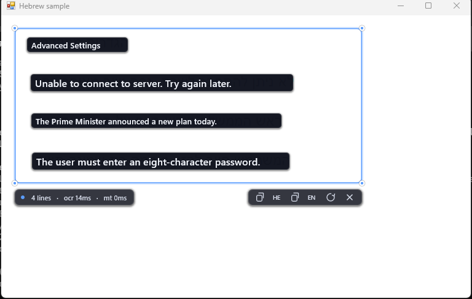
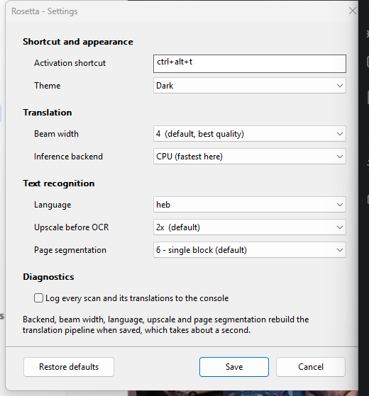

<div align="center">

# Rosetta

**Read Hebrew anywhere on screen. Drag a box over it and the English appears in its place.**

[](#installing-it)
[](#private-by-construction)
[](https://www.rust-lang.org)
[](https://onnxruntime.ai)
[](https://github.com/tesseract-ocr/tesseract)
[](LICENSE)

<br>



<sub>Each Hebrew line is replaced in place by its translation. The pill on the left reports the last scan; <code>mt 0ms</code> means the translations came from cache, which is what keeps dragging the box responsive.</sub>

<br><br>

[Why](#why) · [Features](#features) · [Install](#installing-it) · [Settings](#settings) · [How it works](#how-it-works) · [Measurements](#model-configuration-measured)

</div>

---

## Why

Screen translators normally make you leave what you are reading. You screenshot
a region, switch to a browser, paste, read the translation there, then switch
back and try to remember which paragraph you were on.

Rosetta keeps your eyes where the text is. Press a hotkey, drag a box, and the
Hebrew under the box is covered by its English translation, line by line, in the
same position. Move or resize the box and it re-translates whatever it now
covers. There is no application window: just a tray icon and the overlay, in the
manner of Lightshot or Sleekshot.

The whole pipeline — screen capture, OCR, and a 230M-parameter translation
model — runs on your machine.

## Features

- **Translation in place.** Every recognised line is covered by a panel holding
  its English, sized to the line it replaces and shrunk to fit when the English
  runs longer than the Hebrew, which it usually does.
- **Live.** Drag the box or grab an edge and it re-reads continuously. Scans of
  unchanged pixels are skipped and translations are cached by source string, so
  nudging the box costs almost nothing.
- **Stable.** Tesseract re-runs layout analysis on every frame, and two passes
  over identical content can disagree — which shows up as translations
  flickering in and out. Lines are tracked across frames and held briefly when
  one drops out, so the overlay stays still.
- **A toolbar where you are looking.** Under the selection: copy the recognised
  Hebrew, copy the English, force a re-scan, or close.
- **Configurable hotkey.** `Ctrl+Alt+T` by default, or anything else you like.
- **Multi-monitor aware.** The picker prompt is drawn at the centre of every
  display, not at the centre of the virtual desktop — which on a two-screen
  setup is the seam between them.
- **Dark and light.** Frosted, translucent chrome in either theme.
- **Settings you can click.** Shortcut, theme, beam width, backend, OCR
  language and page segmentation, from the tray menu. Changing anything the
  pipeline depends on rebuilds it in place rather than asking you to restart.
- **A real installer.** Per-user, no admin prompt, Start menu entries, optional
  run-at-sign-in, and an uninstaller that removes everything it wrote.
- **Updates itself.** It can check GitHub for a newer release, then download and
  install it and start itself again, all from the tray menu. Off in one click if
  you would rather it did not.

### Private by construction

There is no server, no telemetry and no account. **Nothing you capture,
recognise or translate ever leaves your machine** — the screen never goes
anywhere, and the model runs locally.

The app makes exactly one kind of network request, and only if you leave it on:
an unauthenticated `GET` to GitHub's releases API to see whether a newer version
exists, at start-up and when you ask. It sends no identifiers beyond the
inevitable user agent and IP address. Turn it off with **Check for updates at
start-up** in Settings, and nothing reaches the network at all.

## Installing it

Grab `Rosetta-Setup-<version>.exe` from the releases page and run it. It
installs per-user, so there is no admin prompt, and it bundles everything: the
binary, the translation model and the OCR engine. Nothing else to fetch.

The installer offers a desktop shortcut and a "start when I sign in" option,
both off by default. Uninstalling removes the lot and asks whether to keep your
settings.

Once it is running the tray icon is all you see:

| | |
| --- | --- |
| `Ctrl+Alt+T` | start a selection |
| double-click the tray icon | the same |
| drag | pick the region; release to translate |
| drag inside, or on an edge | move or resize, re-translating as you go |
| `Esc` | dismiss the overlay |
| right-click the tray icon | the menu below |

The tray menu carries the version at the top — click it for **About** — then the
region picker, a **Start when I sign in** tick, **Check for updates**, and
**Settings**.

## Building it yourself

You need [Rust](https://rustup.rs), and for the one-time asset setup
[uv](https://docs.astral.sh/uv/). Inno Setup is only needed to build installers.

Double-click **`run.cmd`** for a menu, or drive it directly:

```
run.cmd setup      one-time: fetch the model and Tesseract (~1.5GB download)
run.cmd            menu
run.cmd run        launch the tray app
run.cmd build      test and build the release binary
run.cmd package    build the installer into dist\
run.cmd publish    bump, tag and release to GitHub
run.cmd bench      compare int8/fp32 and greedy/beam
```

### The toolbar

Under the selection, beside the status readout:

| Button | What it does |
| --- | --- |
| copy **HE** | the recognised Hebrew, in reading order, to the clipboard |
| copy **EN** | the English translations |
| refresh | re-scan now, ignoring the unchanged-pixels shortcut |
| close | dismiss the overlay |

Refresh turns into a spinner while the pipeline is working.

## Settings

**Settings...** in the tray menu, or `rosetta-desktop.exe settings` if a saved
shortcut ever collides with something else and the app will not start.

<div align="center">

</div>

Settings are stored in `%APPDATA%\Rosetta\settings.json`. Saving applies the
theme, shortcut, update check and logging immediately; changing the backend,
beam width, OCR language, upscale or page segmentation rebuilds the translation
pipeline in place, which takes about a second.

"Start when I sign in" lives in the tray menu rather than here, because it is a
Windows setting (a per-user `Run` entry) rather than one of Rosetta's own. The
installer writes the same value if you tick the box during setup.

### Updating

Rosetta asks GitHub for the latest release at start-up, and says nothing unless
there is one. When there is, or when you pick **Check for updates** yourself, it
offers to do the whole thing: download the installer, run it silently, and start
the new version. Because the installer carries the same `AppId`, that is an
upgrade in place rather than a second copy — the old files are replaced and the
uninstaller is updated.

Nothing downloads until you say yes, and nothing installs behind your back.

```
rosetta-desktop.exe check-updates    ask from the command line
rosetta-desktop.exe about            the About window on its own
```

### Environment overrides

Every setting also has an environment variable, which takes precedence over the
file. This is what the dev scripts use; the settings window says so when one is
active.

`run.cmd run` takes the common ones as switches:

```
run.cmd run -Hotkey ctrl+shift+t -Theme light -Log
```

| Variable | Default | Meaning |
| --- | --- | --- |
| `ROSETTA_HOTKEY` | `ctrl+alt+t` | activation shortcut: ctrl/alt/shift/win plus a letter, digit or `f1`-`f24` |
| `ROSETTA_THEME` | `dark` | `dark` or `light` |
| `ROSETTA_BEAMS` | `4` | beam width; `1` is greedy |
| `ROSETTA_BACKEND` | `cpu` | `cpu`, `dml` (DirectML) or `cuda` (needs `--features cuda`) |
| `ROSETTA_MODELS` | `models` | model directory |
| `ROSETTA_LANG` | `heb` | Tesseract language |
| `ROSETTA_UPSCALE` | `2` | how much to upscale before OCR |
| `ROSETTA_PSM` | `6` | Tesseract page-segmentation mode |
| `ROSETTA_REPO` | `wlwatkins/rosetta-desktop` | which repository to check for updates |
| `ROSETTA_DEBUG` | off | log every scan and its translations |
| `ROSETTA_NO_EXCLUDE` | off | let the overlay appear in screenshots (debug only) |

`Ctrl+Shift+T` is "reopen closed tab" in most browsers, and a global hotkey wins
over the focused app — worth knowing before picking one.

### Without the UI

The same binary exposes the pipeline for testing:

```
rosetta-desktop translate "שלום עולם"
rosetta-desktop ocr <image.png>                   OCR only, with line boxes
rosetta-desktop pipeline <image.png>              OCR then translate
rosetta-desktop grab <x> <y> <w> <h> [out.png]    capture a region and run both
rosetta-desktop bench
```

## How it works

```
src/
  capture.rs    BitBlt screen grab, DPI awareness, monitor bounds
  ocr/          Tesseract C API via libloading; grayscale, upscale, auto-invert
  translate/    Marian encoder/decoder on ONNX Runtime, beam search
  stabilize.rs  temporal smoothing of OCR results
  worker.rs     capture -> OCR -> translate, off the UI thread
  settings.rs   persisted configuration, with environment overrides
  update.rs     GitHub release checking and installer download
  autostart.rs  the per-user Run entry behind "start when I sign in"
  ui/           tray, hotkeys, overlay, settings and about windows
```

Three details carry most of the design.

**The overlay is invisible to screen capture.** It sets
`WDA_EXCLUDEFROMCAPTURE`, so when the worker re-grabs the region the overlay is
sitting on, it gets the original Hebrew rather than the English just painted
there. Without it the live loop feeds on its own output and collapses within a
frame or two.

**OCR results are smoothed over time.** `stabilize.rs` tracks lines in *screen*
coordinates, so they survive the box being dragged, and holds a line that goes
missing for a few frames before retiring it. A scan that finds nothing does not
blank the overlay.

**Translations are cached by source string.** Moving the box re-runs OCR but
almost never the model, which is the difference between a responsive drag and a
slideshow.

## Model configuration, measured

Rosetta uses [`Helsinki-NLP/opus-mt-tc-big-he-en`](https://huggingface.co/Helsinki-NLP/opus-mt-tc-big-he-en),
quantized to int8 and decoded with beam search. That combination is not the
obvious one, so it was measured — `run.cmd bench`, seven sentences, the long one
shown:

| Configuration | Long sentence | Output |
| --- | --- | --- |
| **int8 + beam 4, CPU** | **325 ms** | — |
| fp32 + beam 4, CPU | 787 ms | identical to int8 |
| fp32 + beam 4, DirectML | 1197 ms | identical |
| int8 + beam 4, DirectML | 3978 ms | identical |

Two results worth keeping.

**int8 and fp32 produced byte-identical English on every probe.** Quantization
is not where quality is lost here. The difference that does exist is greedy
versus beam search — greedy gives *"postponed for the next week"* where beam 4
gives *"postponed until next week"* — so beam 4 is the default, matching the
model's own `generation_config.json`.

**The GPU loses.** Each decode step is tiny (batch 4, one token) and the
key/value caches cross PCIe every token, so launch overhead swamps the
arithmetic. Making a GPU pay off here would need IO-binding to keep the caches
device-resident. DirectML and CUDA remain selectable for re-testing on other
hardware.

## Build-time setup

Two generated directories, neither committed. `run.cmd setup` produces both.

**The model.** `opus-mt-tc-big-he-en` publishes no ONNX build, so it is
converted locally: exported with optimum, quantized to int8, and paired with a
`tokenizers` JSON built from its SentencePiece model. This is the only place
Python appears, in a throwaway venv — the app itself has no Python dependency
and nothing from the venv ships.

Marian pairs a 32k SentencePiece model with a 60k shared vocabulary, so piece
IDs come from `vocab.json` rather than from the `.spm`. transformers' own
`convert_slow_tokenizer` cannot express that for Marian, hence the manual
Unigram construction in `tools/export_model.py`.

**Tesseract.** Windows' built-in OCR engine has no Hebrew —
`OcrEngine.TryCreateFromLanguage("he")` returns null — so Tesseract is vendored
beside the executable and loaded at runtime with `libloading`, which is why the
build needs no C++ toolchain. Its installer ships ~50 DLLs, most of them the
pango/cairo/icu stack its PDF tools need; `tools/prune_vendor.py` walks the PE
import tables out from `libtesseract-5.dll` and keeps only what is reachable,
which is 26 of them.

### Repository layout

Only source and configuration are tracked. Everything heavy is generated:

| Path | Size | Tracked | Rebuild with |
| --- | --- | --- | --- |
| `src/`, `scripts/`, `tools/`, `installer/` | ~300KB | yes | — |
| `models/` | 354MB | no | `run.cmd setup` |
| `vendor/` | 133MB | no | `run.cmd setup` |
| `models_fp32/` | 1.4GB | no | `run.cmd setup -KeepFp32` |
| `.venv-export/` | 794MB | no | `run.cmd setup` |
| `target/`, `dist/` | — | no | `run.cmd build` / `run.cmd package` |
| `assets/` | 32KB | yes | `tools/make_icon.py` |

`models_fp32/` exists only so `bench` can compare precisions; without it those
rows are skipped.

## Tests

```
run.cmd build          runs them, then builds
cargo test --release   on their own
```

92 of them, covering the parts where a mistake is quiet rather than loud:
rectangle maths and IoU matching, the stabilizer's hold-and-retire behaviour
(including the flicker case, where a scan finds nothing and the overlay must not
blank), settings clamping and environment precedence, grayscale conversion and
the dark-region inversion, capture fingerprinting, toolbar hit-testing and
drag-resize geometry, hotkey parsing, version comparison and release parsing,
and a round-trip through the real `Run` registry key under a test-only name.

## Known limitations

- **Per-line translation.** Each OCR line is translated on its own, so a
  paragraph wrapped over several lines loses cross-line context. Reassembling
  sentences would read better but makes positioning much harder.
- **The translation panels are opaque.** They cannot be frosted like the rest of
  the chrome, because they are covering the Hebrew and any translucency lets the
  original show through.
- **OCR quality is Tesseract's.** Clean rendered text is close to perfect;
  dense, small or low-contrast text degrades.
- **Windows 10/11 only.** It is built on Win32, Direct2D and
  `WDA_EXCLUDEFROMCAPTURE`.

## Third-party components

The repository contains none of these; setup fetches them, and `run.cmd package`
bundles them into the folder it produces. Redistributing that folder carries
these terms:

| Component | License | Used for |
| --- | --- | --- |
| [opus-mt-tc-big-he-en](https://huggingface.co/Helsinki-NLP/opus-mt-tc-big-he-en) (Helsinki-NLP / OPUS-MT) | CC-BY-4.0 | Hebrew to English translation |
| [Tesseract](https://github.com/tesseract-ocr/tesseract) 5 and [tessdata_best](https://github.com/tesseract-ocr/tessdata_best) | Apache-2.0 | OCR |
| [ONNX Runtime](https://onnxruntime.ai) | MIT | model inference |

CC-BY-4.0 requires attribution to the OPUS-MT authors; the table above is it.

## License

[GPL-3.0](LICENSE). Use it at home or at work, on as many machines as you like,
and modify it freely. If you redistribute it, in original or modified form, you
must pass on the source code and the same freedoms to whoever receives it.

The third-party terms above are separate and apply either way.

---

<div align="center">
<sub>Built with Rust, ONNX Runtime, Tesseract and Direct2D. Runs entirely offline.</sub>
</div>
